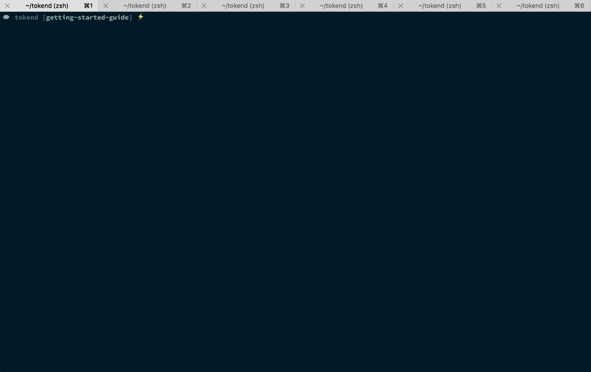

# Development

There are a few dependencies required to develop against Tokend:

* A [Vault][] server
* An AWS EC2 Metadata source
* A [Warden][] server

Luckily, all three of these dependencies can be assembled easily.

## Vault
[Vault][] can be run in [dev server mode][] which allows the user to pass a `-dev-root-token-id` command line argument in order to specify the root token with which Vault will start. For example:

```bash
$ vault server -dev -dev-root-token-id="my-token"
```

## AWS EC2 Metadata Source
Tokend ships with a dummy EC2 Metadata source out of the box. Simply run

```bash
$ npm run metadata-server
```

Then point your Tokend [configuration][] at `127.0.0.1:8900`.

## Warden Server
[Warden][] is available to download and install separately from Tokend. However, as a helpful tool, we have included a mock Warden server that will verify *every* request and return a Vault token. You can use it by running

```bash
$ npm run warden-mock -- my-token
```
"`my-token`" in the previous example must match with the token provided to [Vault](#vault).

## Putting it all together



[Vault]: https://www.vaultproject.io/
[Warden]: https://github.com/rapid7/warden
[dev server mode]: https://www.vaultproject.io/docs/concepts/dev-server.html
[configuration]: ./configuration.md